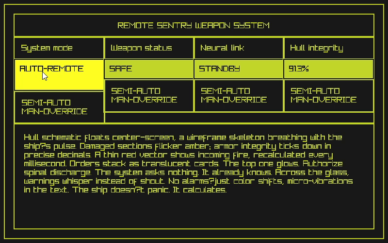

# Syl

An experimental **retained-mode** GUI library for the [Odin programming language](https://odin-lang.org/).

Syl is an initiative to build a viable and competitive alternative for creating highly interactive graphical user interfaces for applications and video games, using a retained-mode architecture that can be adapted to the vendor graphics libraries available in Odin. It takes inspiration from the web to allow flexible styling and to make adding animations straightforward, improving the user experience.

With a retained-mode approach, Syl maintains a persistent representation of the interface, enabling efficient updates, clear separation between state and rendering, and simpler reasoning about complex layouts. This model makes it easier to optimize redraws, manage interactions, and scale interfaces as they grow in size and complexity.

> ⚠️WARNING! Syl is an experimental library. The final architecture is still undefined and may change significantly as the project evolves, so it is not suitable for real-world projects.
> 

## Features

- **Flex-box Layout Engine:** A layout system inspired by [Clay](https://github.com/nicbarker/clay), allowing for responsive and predictable element positioning.
    
- **CSS-like Transitions:** Built-in support for smooth animations through a transition system that interpolates colors, sizes, and other element properties.
    
- **Renderer Agnostic:** The core library handles logic and layout.
    - Included: Reference implementation for **Raylib**.
    
* **Styling System:** A decoupled styling system that enables easy theming and state-based visual changes.

### Elements
* Box: acts as a Flex-box item or container.
* Text: wraps based on the parent `Box` width.

### Contributing
Syl is an open and exploratory project. Contributions, experiments, and discussions around its design and development are strongly encouraged, especially ideas that help shape the final architecture and long-term direction of the library.

Join the [Discord server](https://discord.gg/guHwySTgtZ) for discussion and feedback.
